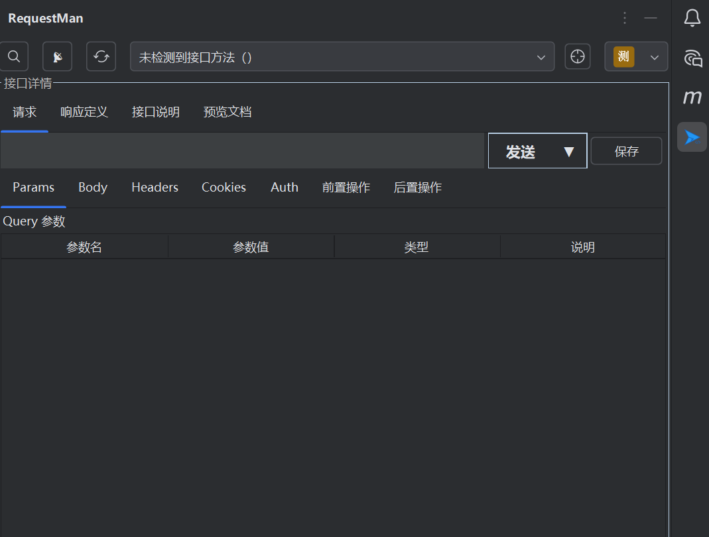

# RequestMan

<div align="center">

**Language / 语言**: [English](README.md) | [简体中文](README.zh-CN.md)

</div>

<div align="center">


**An API Testing and Documentation Tool Integrated with IntelliJ IDEA**

[](https://plugins.jetbrains.com/plugin/request-man)
[](https://www.jetbrains.com/idea/)
[](LICENSE)

</div>

## 📖 Project Overview

RequestMan is an API testing and documentation plugin specifically developed for IntelliJ IDEA, supporting seamless switching between "API Scanning Mode" and "Custom API Mode". By intelligently scanning Spring APIs in your project, it automatically generates API lists and parameter structures, while also supporting manual creation and management of custom APIs, providing developers with an efficient API testing and documentation management solution.

## ✨ Core Features

### 🔍 Intelligent API Scanning
- **One-Click Scan**: Automatically scans all Spring APIs in the project (`@RestController`, `@RequestMapping`, etc.)
- **Smart Recognition**: Precisely identifies Spring Mapping annotations, avoiding interference from custom annotations
- **Parameter Extraction**: Automatically extracts API parameters, request body structure, and authentication information
- **Documentation Generation**: Supports API documentation preview and JSON example generation

### 🛠️ Custom API Management
- **Flexible Creation**: Manually add, edit, and save custom APIs
- **Multi-Type Support**: Supports JSON, form-data, x-www-form-urlencoded, XML, binary, and other request body types
- **Advanced Features**: Supports parameter validation, authentication configuration, post-operations, etc.
- **Batch Operations**: Supports multi-select, batch import/export

### 🌍 Environment and Variable Management
- **Environment Management**: Supports development, testing, production, and other multi-environment configurations
- **Global Variables**: Supports CRUD operations for global variables, using `{{variableName}}` for dynamic references
- **Parameter Persistence**: API parameters, request bodies, Headers, Cookies, etc. are automatically persisted
- **Cache Optimization**: Intelligent caching mechanism for improved performance

### 🔎 Efficient Search and Navigation
- **Hotkey Search**: `Ctrl+Alt+/` to instantly pop up API search window
- **Multi-Dimensional Search**: Supports searching by URL, method name, third-party packages, etc.
- **Keyboard Navigation**: Supports keyboard up/down browsing, enter to jump, pagination loading
- **Real-time Filtering**: Supports real-time search and filtering

### 📊 Response Processing and Documentation
- **Response Collapse**: Supports response content collapse and expansion
- **JSON Formatting**: Automatically formats JSON response content
- **Documentation Preview**: Structured preview of API documentation
- **JSONPath Extraction**: Built-in JSONPath extractor, supports extracting variables from responses

### 🔄 API Import/Export
- **Import/Export**: Supports import/export functionality for API collections
- **JSON Format**: Uses standard JSON format for data exchange
- **Batch Operations**: Supports batch import/export of API collections

## 🚀 Quick Start

### 1. Install Plugin

**Method 1: Install from Plugin Marketplace (Recommended)**
1. Click [RequestMan Plugin Marketplace Link](https://plugins.jetbrains.com/plugin/28114-requestman) to jump directly
2. Click "Install" button to install
3. Restart IDE

**Method 2: Install from within IDE**
1. Open IntelliJ IDEA
2. Go to `File` → `Settings` → `Plugins`
3. Search for "RequestMan" and install
4. Restart IDE

### 2. Basic Configuration

1. Open `File` → `Settings` → `RequestMan Settings`
2. Configure environment management:
    - Add development, testing, production environments
    - Set base URLs for each environment
3. Configure global variables:
    - Add commonly used global variables
    - Use `{{variableName}}` format for references


*RequestMan Settings Interface - Environment Management Configuration*

### 3. API Scanning Mode

1. Open RequestMan tool window (right sidebar)
2. Click "Refresh APIs" button to automatically scan Spring APIs in the project
3. Select the API to test from the dropdown list
4. Configure parameters, request body, Headers, etc.
5. Click "Send" button to test the API



*RequestMan Main Interface - API Scanning Mode*

### 4. Custom API Mode

1. Click "Switch Mode" button to switch to custom API mode
2. Click "Add API" button to create custom API
3. Fill in API name, URL, HTTP method, etc.
4. Configure parameters, request body, authentication, etc.
5. Save and test the API


*RequestMan Custom API Mode*

### 5. API Search

1. Press `Ctrl+Alt+/` hotkey to open search window
2. Enter keywords to search for APIs
3. Use keyboard navigation to select API
4. Press Enter to jump to the corresponding API


*RequestMan API Search Feature*

## 📋 Detailed Feature Description

### API Scanning Mode

**Use Case**: API testing for existing Spring projects

**Main Features**:
- Automatically scans all Spring APIs in the project
- Intelligently extracts API parameters and request body structure
- Supports API documentation preview
- Supports JSON example generation
- Supports parameter persistence and caching

**Usage Flow**:
1. Ensure the project has Spring APIs (using `@RestController`, `@RequestMapping`, etc. annotations)
2. Open RequestMan tool window
3. Click "Refresh APIs" to start scanning
4. Select the API to test from the API list
5. Configure request parameters and authentication information
6. Send request and view response

### Custom API Mode

**Use Case**: Manual creation and management of API interfaces

**Main Features**:
- Manually create custom API interfaces
- Supports multiple request body types (JSON, form-data, x-www-form-urlencoded, XML, binary)
- Supports parameter validation and type checking
- Supports authentication configuration (Basic, Bearer Token, API Key, etc.)
- Supports post-operations (variable extraction, data validation, etc.)
- Supports batch import/export

**Usage Flow**:
1. Switch to custom API mode
2. Click "Add API" to create new API
3. Fill in basic API information (name, URL, method, etc.)
4. Configure request parameters and request body
5. Set authentication information and post-operations
6. Save API and test

### Environment Management

**Features**:
- Supports multi-environment configuration (development, testing, production, etc.)
- Each environment can set different base URLs
- Supports environment switching and quick switching
- Environment configuration persistent storage

**Configuration Method**:
1. Open `File` → `Settings` → `RequestMan Settings`
2. Select "Environment Management" tab
3. Add or edit environment configuration
4. Set environment name and base URL

### Global Variable Management

**Features**:
- Supports CRUD operations for global variables
- Variables can be dynamically referenced in request parameters, Headers, authentication, etc.
- Use `{{variableName}}` format to reference variables
- Supports dynamic updates of variable values

**Usage Method**:
1. Configure global variables in settings
2. Use `{{variableName}}` in request parameters to reference variables
3. Variable values are automatically replaced when sending requests

### JSONPath Extractor

**Features**:
- Built-in JSONPath extractor tool
- Supports extracting field paths from JSON responses
- Visual field list, double-click to quickly select
- Real-time preview of extraction results
- Supports complex JSON structure parsing

**Use Cases**:
- Variable extraction in post-operations
- Field analysis of response data
- Data validation in API testing


*RequestMan JSONPath Extractor Tool*

### API Import/Export

**Features**:
- Supports import/export functionality for API collections
- Uses standard JSON format for data exchange
- Supports both overwrite and append import modes
- Supports batch import/export operations

**Usage Method**:
1. **Import**: Right-click on empty space in custom API list, select "Import"
2. **Export**: Select APIs to export, right-click and select "Export"

## ⚙️ Performance Optimization

### Intelligent Project Detection
- Automatically adjusts scanning strategy based on project size
- Supports multi-module project structure
- Intelligently filters non-source code directories
- Scanning depth and file count limitations

### Caching Mechanism
- Project-level cache isolation to avoid multi-project confusion
- Local file persistent cache with maximum 200 records
- Thread-safe cache operations
- Automatic cache cleanup when project closes

### Thread Pool Optimization
- Uses `ThreadPoolExecutor` for precise thread resource control
- Optimized thread pool parameter configuration
- Complete resource cleanup mechanism
- Prevents memory leaks

## 🛠️ Technical Architecture

### Core Technology Stack
- **Java 21**: Primary development language
- **IntelliJ Platform SDK**: Plugin development framework
- **Swing**: User interface framework
- **Hutool**: Utility class library
- **Gradle**: Build tool

### Project Structure
```
src/main/java/com/ljh/request/requestman/
├── action/          # Action handlers
├── constant/        # Constant definitions
├── enums/          # Enum types
├── model/          # Data models
├── search/         # Search functionality
├── startup/        # Startup activities
├── ui/             # User interface
└── util/           # Utility classes
```

### Core Modules
- **API Scanning**: `ProjectApiScanner` - Responsible for scanning Spring APIs in the project
- **Parameter Management**: `ParamsPanel`, `BodyPanel` - Manage request parameters and request body
- **Response Processing**: `ResponseCollapsePanel` - Handle response display and formatting
- **Variable Management**: `VariableManager` - Manage global variables and dynamic references
- **Post-Operations**: `PostOpExecutor` - Execute post-operations and variable extraction

## 📝 Changelog

### v1.0.1
- ✨ Path parameter dynamic URL update functionality
- ✨ Auto-save control functionality with user preference settings
   - Silent save option
   - Save prompt before leaving
   - Visual indicator for unsaved state
   - Save button state management
- ✨ JSON structure panel supporting recursive structure, can handle complex nested parameters
- 🚀 Improved Path parameter functionality, fixed listener issues and entity recursion
- 🐛 Replaced deprecated and experimental APIs with stable alternatives
- 🐛 Fixed experimental API usage warnings in UI components

### v1.0.0
- 🚀 Refactored and optimized codebase for improved maintainability
- 🚀 Enhanced plugin documentation and user guide

### v0.9.9
- ✨ Added JSONPath extractor functionality
- ✨ Added API import/export functionality
- ✨ Added environment management functionality
- ✨ Added global variable management functionality
- 🚀 Performance optimization and cache mechanism improvements
- 🐛 Fixed duplicate and misjudgment issues in API scanning
- 🐛 Fixed large project scanning performance issues

### v0.9.8
- ✨ Added API search functionality
- ✨ Added custom API mode
- 🚀 Optimized API scanning performance
- 🐛 Fixed multiple known issues

[//]: # (## 🤝 Contributing)

[//]: # ()
[//]: # (We welcome all forms of contributions! If you want to contribute to RequestMan, please:)

[//]: # ()
[//]: # (1. Fork this repository)

[//]: # (2. Create your feature branch &#40;`git checkout -b feature/AmazingFeature`&#41;)

[//]: # (3. Commit your changes &#40;`git commit -m 'Add some AmazingFeature'`&#41;)

[//]: # (4. Push to the branch &#40;`git push origin feature/AmazingFeature`&#41;)

[//]: # (5. Open a Pull Request)

### Development Environment Setup

1. Clone the repository:
   ```bash
   git clone https://github.com/komorebiCarry/request-man.git
   cd request-man
   ```

2. Open the project with IntelliJ IDEA

3. Configure Gradle build

4. Run the plugin for testing

## 📄 License

This project is licensed under the MIT License - see the [LICENSE](LICENSE) file for details.

## 🙏 Acknowledgments

Thanks to all developers who have contributed to RequestMan!

## 📞 Contact Us

- **Project Repository**: https://github.com/komorebiCarry/request-man
- **Plugin Marketplace**: https://plugins.jetbrains.com/plugin/28114-requestman
- **Issue Reports**: https://github.com/komorebiCarry/request-man/issues
- **Feature Suggestions**: https://github.com/komorebiCarry/request-man/issues

---

<div align="center">

**If RequestMan is helpful to you, please give us a ⭐️**

</div>
