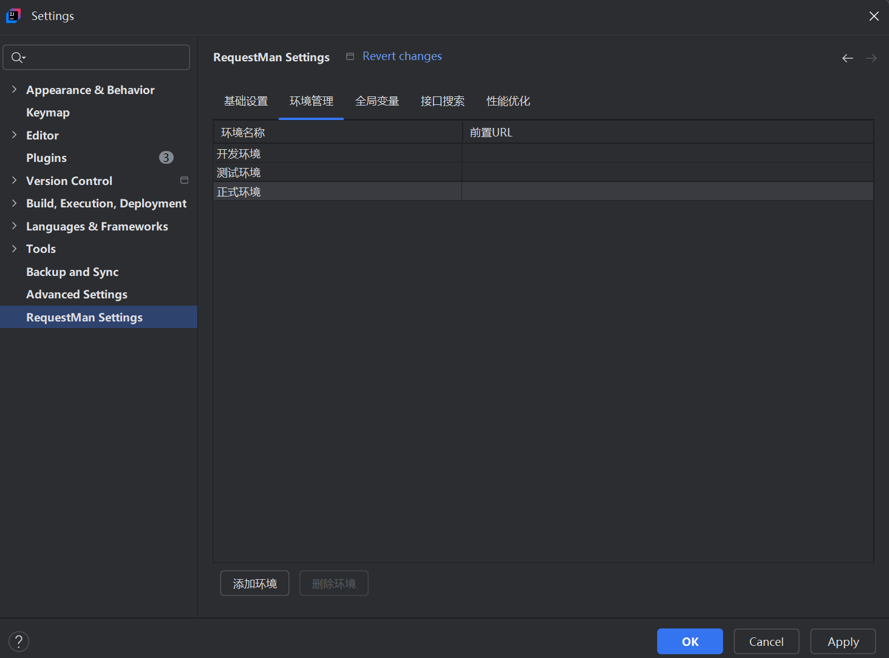
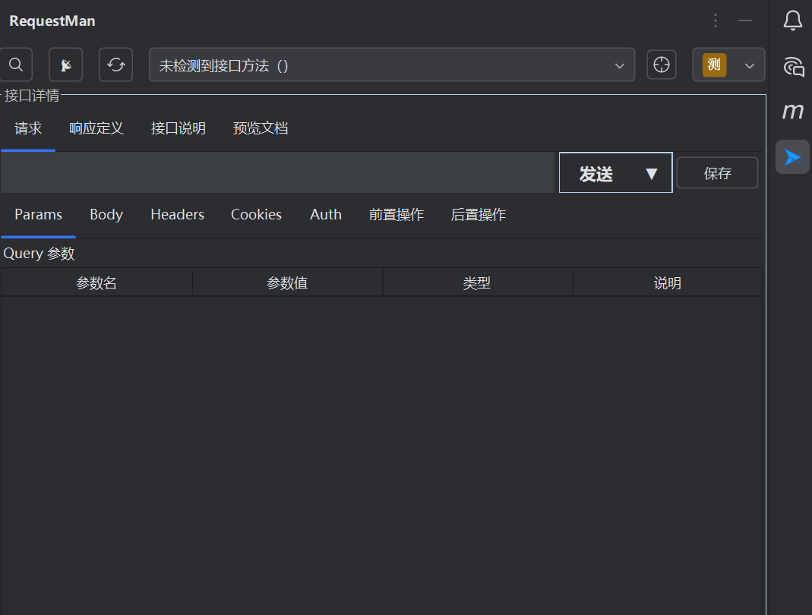
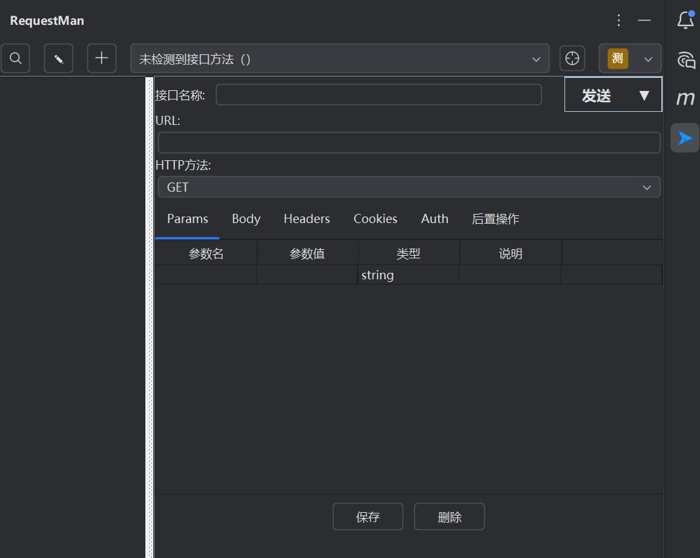
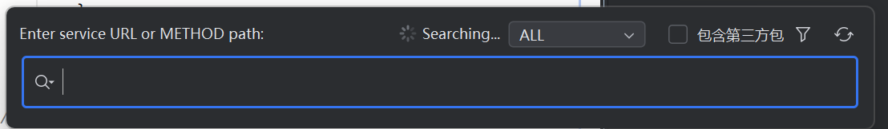
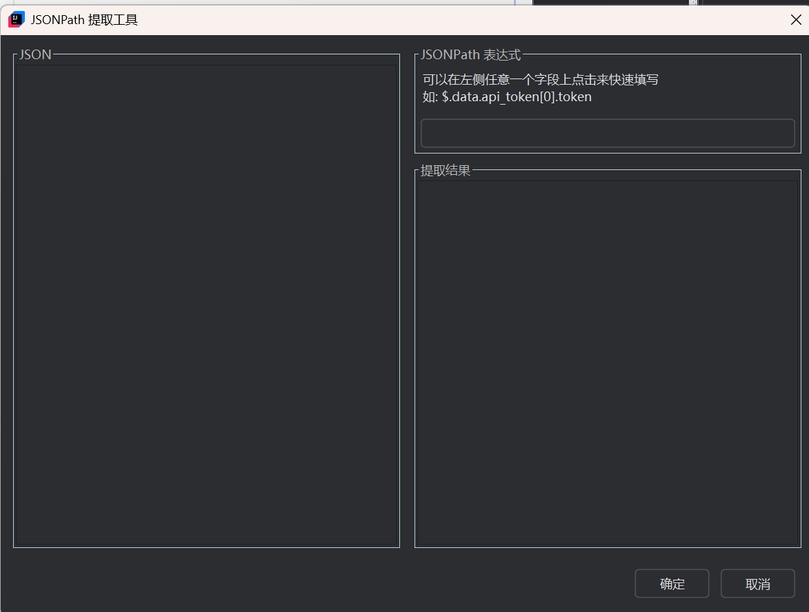

# RequestMan

<div align="center">

**Language / 语言**: [English](README.md) | [简体中文](README.zh-CN.md)

</div>

<div align="center">


**一款集成于 IntelliJ IDEA 的接口调试与文档生成工具**

[](https://plugins.jetbrains.com/plugin/request-man)
[](https://www.jetbrains.com/idea/)
[](LICENSE)

</div>

## 📖 项目简介

RequestMan 是一款专为 IntelliJ IDEA 开发的接口调试与文档生成插件，支持"接口扫描模式"与"自定义接口模式"自由切换。通过智能扫描项目中的 Spring 接口，自动生成接口列表和参数结构，同时支持手动创建和管理自定义 API，为开发者提供高效的接口调试和文档管理解决方案。

## ✨ 核心特性

### 🔍 智能接口扫描
- **一键扫描**：自动扫描项目中的所有 Spring 接口（`@RestController`、`@RequestMapping` 等）
- **智能识别**：精确识别 Spring Mapping 注解，避免自定义注解干扰
- **参数提取**：自动提取接口参数、请求体结构、认证信息
- **文档生成**：支持接口文档预览与 JSON 示例生成

### 🛠️ 自定义接口管理
- **灵活创建**：手动添加、编辑、保存自定义 API
- **多类型支持**：支持 JSON、form-data、x-www-form-urlencoded、XML、binary 等多种请求体类型
- **高级功能**：支持参数验证、认证配置、后置操作等
- **批量操作**：支持多选、批量导入导出

### 🌍 环境与变量管理
- **环境管理**：支持开发、测试、生产等多环境配置
- **全局变量**：支持全局变量的增删改查，使用 `{{变量名}}` 动态引用
- **参数持久化**：接口参数、请求体、Headers、Cookies 等自动持久化
- **缓存优化**：智能缓存机制，提升性能

### 🔎 高效搜索与定位
- **快捷键搜索**：`Ctrl+Alt+/` 一键弹出接口搜索窗口
- **多维度检索**：支持按 URL、方法名、三方包等多维度搜索
- **键盘导航**：支持键盘上下键浏览、回车跳转、分页加载
- **实时过滤**：支持实时搜索和过滤

### 📊 响应处理与文档
- **响应折叠**：支持响应内容折叠和展开
- **JSON 格式化**：自动格式化 JSON 响应内容
- **文档预览**：接口文档结构化预览
- **JSONPath 提取**：内置 JSONPath 提取器，支持从响应中提取变量

### 🔄 接口导入导出
- **导入导出**：支持接口集合的导入导出功能
- **JSON 格式**：使用标准 JSON 格式进行数据交换
- **批量操作**：支持批量导入导出接口集合

## 🚀 快速开始

### 1. 安装插件

**方式一：从插件市场安装（推荐）**
1. 点击 [RequestMan 插件市场链接](https://plugins.jetbrains.com/plugin/28114-requestman) 直接跳转
2. 点击 "Install" 按钮安装
3. 重启 IDE

**方式二：从 IDE 内安装**
1. 打开 IntelliJ IDEA
2. 进入 `File` → `Settings` → `Plugins`
3. 搜索 "RequestMan" 并安装
4. 重启 IDE

### 2. 基础配置

1. 打开 `File` → `Settings` → `RequestMan Settings`
2. 配置环境管理：
    - 添加开发、测试、生产环境
    - 设置各环境的前置 URL
3. 配置全局变量：
    - 添加常用的全局变量
    - 使用 `{{变量名}}` 格式引用



*RequestMan 设置界面 - 环境管理配置*

### 3. 接口扫描模式

1. 打开 RequestMan 工具窗口（右侧边栏）
2. 点击"刷新接口"按钮，自动扫描项目中的 Spring 接口
3. 从下拉列表选择要调试的接口
4. 配置参数、请求体、Headers 等
5. 点击"发送"按钮测试接口



*RequestMan 主界面 - 接口扫描模式*

### 4. 自定义接口模式

1. 点击"切换模式"按钮，切换到自定义接口模式
2. 点击"新增接口"按钮创建自定义 API
3. 填写接口名称、URL、HTTP 方法等信息
4. 配置参数、请求体、认证等
5. 保存并测试接口



*RequestMan 自定义接口模式*

### 5. 接口搜索

1. 按 `Ctrl+Alt+/` 快捷键打开搜索窗口
2. 输入关键词搜索接口
3. 使用键盘导航选择接口
4. 按回车键跳转到对应接口



*RequestMan 接口搜索功能*

## 📋 详细功能说明

### 接口扫描模式

**适用场景**：已有 Spring 项目的接口调试

**主要功能**：
- 自动扫描项目中的所有 Spring 接口
- 智能提取接口参数和请求体结构
- 支持接口文档预览
- 支持 JSON 示例生成
- 支持参数持久化和缓存

**使用流程**：
1. 确保项目中有 Spring 接口（使用 `@RestController`、`@RequestMapping` 等注解）
2. 打开 RequestMan 工具窗口
3. 点击"刷新接口"开始扫描
4. 从接口列表中选择要调试的接口
5. 配置请求参数和认证信息
6. 发送请求并查看响应

### 自定义接口模式

**适用场景**：手动创建和管理 API 接口

**主要功能**：
- 手动创建自定义 API 接口
- 支持多种请求体类型（JSON、form-data、x-www-form-urlencoded、XML、binary）
- 支持参数验证和类型检查
- 支持认证配置（Basic、Bearer Token、API Key 等）
- 支持后置操作（变量提取、数据验证等）
- 支持批量导入导出

**使用流程**：
1. 切换到自定义接口模式
2. 点击"新增接口"创建新接口
3. 填写接口基本信息（名称、URL、方法等）
4. 配置请求参数和请求体
5. 设置认证信息和后置操作
6. 保存接口并测试

### 环境管理

**功能特性**：
- 支持多环境配置（开发、测试、生产等）
- 每个环境可设置不同的前置 URL
- 支持环境切换和快速切换
- 环境配置持久化保存

**配置方法**：
1. 打开 `File` → `Settings` → `RequestMan Settings`
2. 选择"环境管理"标签页
3. 添加或编辑环境配置
4. 设置环境名称和前置 URL

### 全局变量管理

**功能特性**：
- 支持全局变量的增删改查
- 变量可在请求参数、Headers、认证等场景中动态引用
- 使用 `{{变量名}}` 格式引用变量
- 支持变量值的动态更新

**使用方法**：
1. 在设置中配置全局变量
2. 在请求参数中使用 `{{变量名}}` 引用变量
3. 变量值会在请求发送时自动替换

### JSONPath 提取器

**功能特性**：
- 内置 JSONPath 提取器工具
- 支持从 JSON 响应中提取字段路径
- 可视化字段列表，双击快速选择
- 实时预览提取结果
- 支持复杂 JSON 结构解析

**使用场景**：
- 后置操作中的变量提取
- 响应数据的字段分析
- API 测试中的数据验证



*RequestMan JSONPath 提取器工具*

### 接口导入导出

**功能特性**：
- 支持接口集合的导入导出功能
- 使用标准 JSON 格式进行数据交换
- 支持覆盖和追加两种导入模式
- 支持批量导入导出操作

**使用方法**：
1. **导入**：右键点击自定义接口列表空白处，选择"导入"
2. **导出**：选择要导出的接口，右键选择"导出"

## ⚙️ 性能优化

### 智能项目检测
- 根据项目大小自动调整扫描策略
- 支持多模块项目结构
- 智能过滤非源码目录
- 扫描深度和文件数量限制

### 缓存机制
- 项目级别缓存隔离，避免多项目混淆
- 本地文件持久化缓存，最大缓存 200 条记录
- 线程安全的缓存操作
- 项目关闭时自动清理缓存

### 线程池优化
- 使用 `ThreadPoolExecutor` 精确控制线程资源
- 优化的线程池参数配置
- 完善的资源清理机制
- 避免内存泄漏

## 🛠️ 技术架构

### 核心技术栈
- **Java 21**：主要开发语言
- **IntelliJ Platform SDK**：插件开发框架
- **Swing**：用户界面框架
- **Hutool**：工具类库
- **Gradle**：构建工具

### 项目结构
```
src/main/java/com/ljh/request/requestman/
├── action/          # 动作处理器
├── constant/        # 常量定义
├── enums/          # 枚举类型
├── model/          # 数据模型
├── search/         # 搜索功能
├── startup/        # 启动活动
├── ui/             # 用户界面
└── util/           # 工具类
```

### 核心模块
- **接口扫描**：`ProjectApiScanner` - 负责扫描项目中的 Spring 接口
- **参数管理**：`ParamsPanel`、`BodyPanel` - 管理请求参数和请求体
- **响应处理**：`ResponseCollapsePanel` - 处理响应显示和格式化
- **变量管理**：`VariableManager` - 管理全局变量和动态引用
- **后置操作**：`PostOpExecutor` - 执行后置操作和变量提取

## 📝 更新日志

### v1.0.1
- ✨ Path参数动态URL更新功能
- ✨ 自动保存控制功能，支持用户偏好设置
   - 静默保存选项
   - 离开前保存提示
   - 未保存状态视觉标识
   - 保存按钮状态管理
- ✨ JSON结构面板，支持递归结构，可处理复杂的嵌套参数
- 🚀 改进Path参数功能，修复监听器问题和实体递归
- 🐛 用稳定的替代方案替换已弃用和实验性API
- 🐛 修复UI组件中的实验性API使用警告

### v1.0.0
- 🚀 重构和优化代码库，提升可维护性
- 🚀 增强插件文档和用户指南

### v0.9.9
- ✨ 新增 JSONPath 提取器功能
- ✨ 新增接口导入导出功能
- ✨ 新增环境管理功能
- ✨ 新增全局变量管理功能
- 🚀 性能优化和缓存机制改进
- 🐛 修复接口扫描的重复和误判问题
- 🐛 修复大项目扫描性能问题

### v0.9.8
- ✨ 新增接口搜索功能
- ✨ 新增自定义接口模式
- 🚀 优化接口扫描性能
- 🐛 修复多个已知问题

[//]: # (## 🤝 贡献指南)

[//]: # ()
[//]: # (我们欢迎所有形式的贡献！如果您想为 RequestMan 做出贡献，请：)

[//]: # ()
[//]: # (1. Fork 本仓库)

[//]: # (2. 创建您的特性分支 &#40;`git checkout -b feature/AmazingFeature`&#41;)

[//]: # (3. 提交您的更改 &#40;`git commit -m 'Add some AmazingFeature'`&#41;)

[//]: # (4. 推送到分支 &#40;`git push origin feature/AmazingFeature`&#41;)

[//]: # (5. 打开一个 Pull Request)

### 开发环境设置

1. 克隆仓库：
   ```bash
   git clone https://github.com/komorebiCarry/request-man.git
   cd request-man
   ```

2. 使用 IntelliJ IDEA 打开项目

3. 配置 Gradle 构建

4. 运行插件进行测试

## 📄 许可证

本项目采用 MIT 许可证 - 查看 [LICENSE](LICENSE) 文件了解详情。

## 🙏 致谢

感谢所有为 RequestMan 做出贡献的开发者！

## 📞 联系我们

- **项目地址**：https://github.com/komorebiCarry/request-man
- **插件市场**：https://plugins.jetbrains.com/plugin/28114-requestman
- **问题反馈**：https://github.com/komorebiCarry/request-man/issues
- **功能建议**：https://github.com/komorebiCarry/request-man/issues

---

<div align="center">

**如果 RequestMan 对您有帮助，请给我们一个 ⭐️**

</div>
